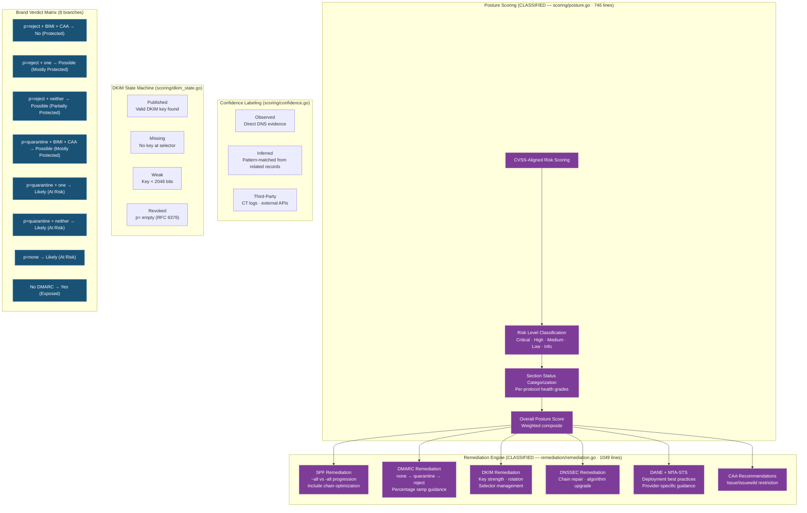
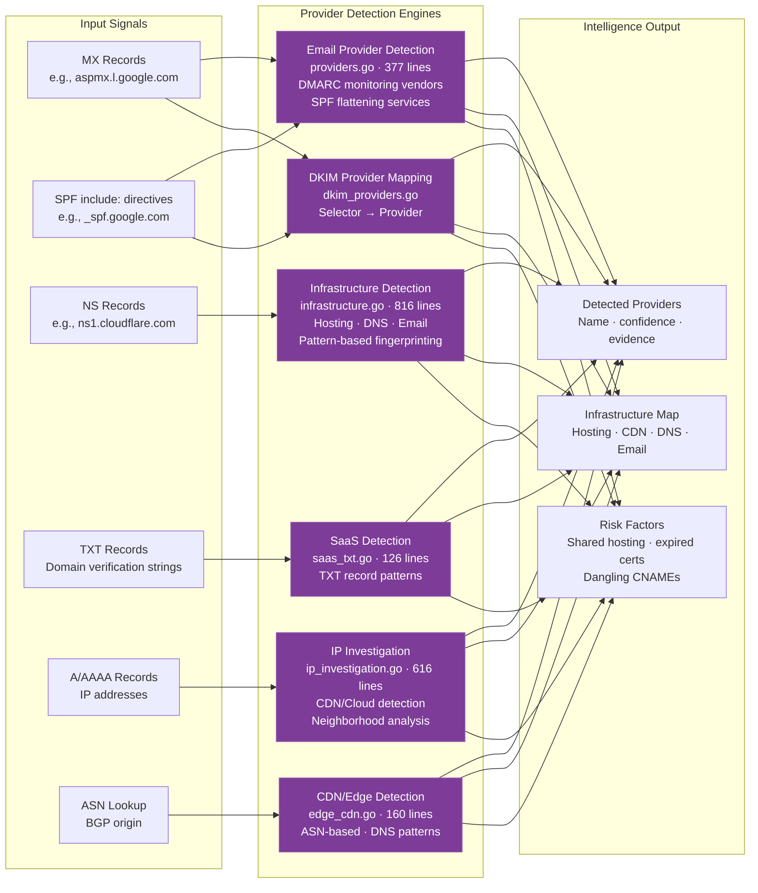
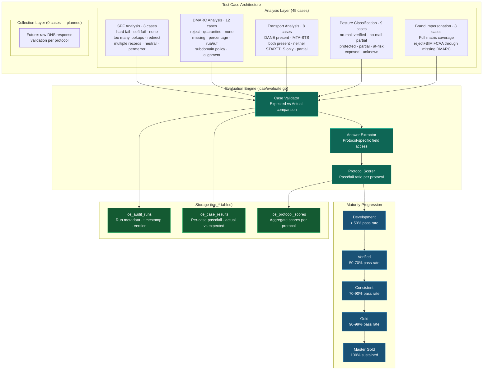
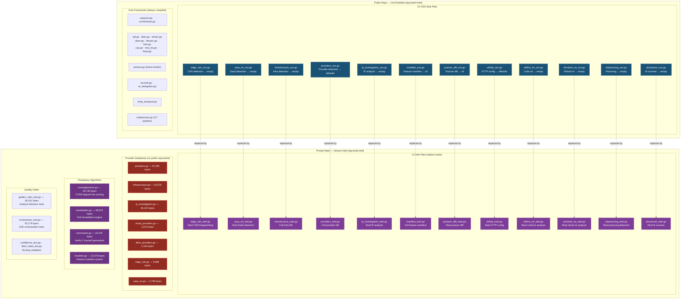
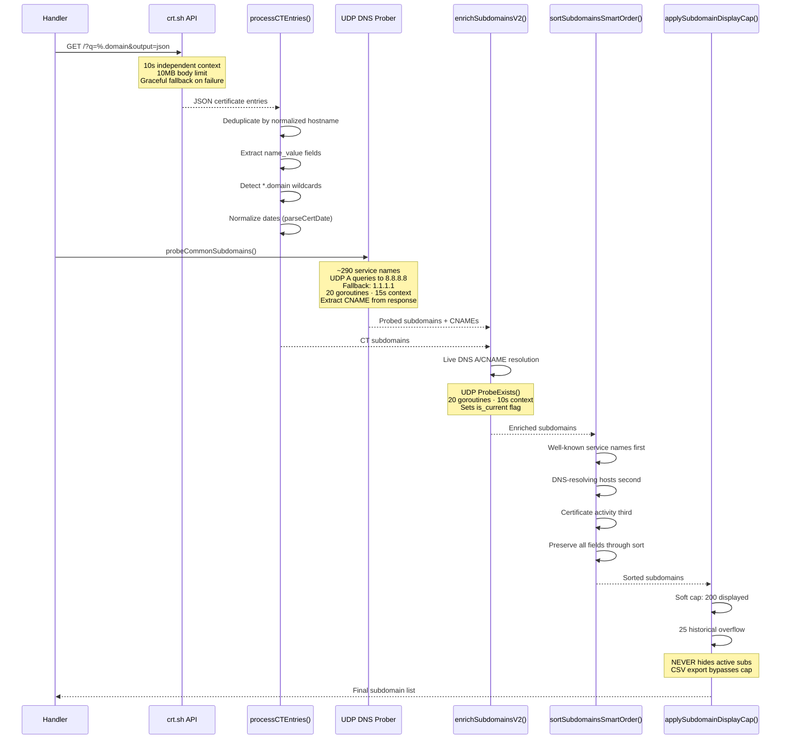
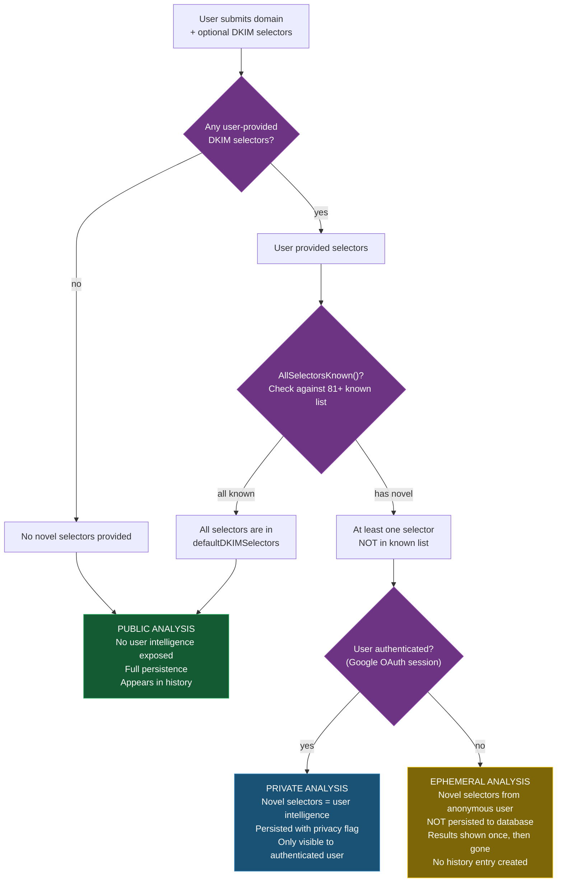

# Archived — Build-Tag Era History

> **Status:** ARCHIVED (consolidated v26.48). Historical reference only.
>
> This document consolidates five previously separate archived docs that all
> described the former two-repo open-core architecture (`//go:build intel` /
> `//go:build !intel`). In v26.48 the Intel repository was merged into the
> single public repo (`IT-Help-San-Diego/dns-tool-intel`, BUSL-1.1), all build
> tags were removed, and every `_oss.go` stub was renamed to `_impl.go`.
>
> **Current architecture:** see `docs/architecture/SYSTEM_ARCHITECTURE.md`.
> **Reference:** Miro Blueprint board `uXjVG83d8PY=` (documents A11 and A13)
> is a presentation mirror only — it is not canonical.
>
> Sections below preserve the key historical decisions, incident context, and
> lessons learned from the original files. Source snapshots:
>
> | Section | Replaces | Original date |
> |---|---|---|
> | [1. Build Tag Strategy](#1-build-tag-strategy) | `docs/BUILD_TAG_STRATEGY.md` | (header-only stub) |
> | [2. Stub-to-Private-Repo Audit](#2-stub-to-private-repo-audit) | `STUB_AUDIT.md` | 2026-02-14 |
> | [3. Classified Intelligence Architecture](#3-classified-intelligence-architecture) | `docs/ARCHITECTURE_CLASSIFIED.md` | v26.20.73 (Feb 19, 2026) |
> | [4. SonarCloud Mission Briefing](#4-sonarcloud-mission-briefing) | `docs/sonar-mission-briefing.md` | March 28, 2026 (v26.40.15) |
> | [5. Single-Repo Migration](#5-single-repo-migration) | `docs/SINGLE_REPO_MIGRATION.md` | 2026-03-30 |
>
> **Also retired in v26.48:** `scripts/intel-breadcrumbs-sync.sh` — the
> two-repo-era helper that fetched these documents from the former private
> `dns-tool-intel` repo into `.intel/breadcrumbs/`. The script now exists only
> as a deprecation stub that exits non-zero with a pointer back to this file,
> so any stale invocation fails loudly instead of chasing files that no longer
> exist (`STUB_AUDIT.md`, `docs/ARCHITECTURE_CLASSIFIED.md`,
> `docs/BUILD_TAG_STRATEGY.md`).

---

## 1. Build Tag Strategy

The former two-repo open-core architecture used Go build tags to gate
classified intelligence code:

- `//go:build !intel` — public OSS stubs (empty maps, no-op functions, default
  return values). Compiled by default.
- `//go:build intel` — full intelligence implementations (provider databases,
  CVSS-aligned scoring, the remediation engine, AI surface analyzers).
  Compiled with `go build -tags intel`.

Twelve `_oss.go` stub files in the public repo had matching `_intel.go`
implementations in the private `dnstool-intel` repo. The boundary was
enforced by tests that verified build-tag gating rather than asserting file
absence.

In v26.48 this entire mechanism was removed: the two repos were unified, all
`_oss.go` files were renamed `_impl.go`, and there is no longer any compile
flag distinction between OSS and Intel builds.

---

## 2. Stub-to-Private-Repo Audit

*Generated 2026-02-14. Mapped every public-repo stub file to the real
implementation that lived in `dnstool-intel`.*

**Status key:**
- **NEEDS UPDATE:** Today's changes require a new/updated private repo file
- **VERIFY:** Already exists in private repo — confirm it's complete
- **OK:** No action needed (stub is self-contained)

### 2.1 providers.go → providers/   *(NEEDS UPDATE)*

`isKnownDKIMProvider` was added as a new stub. The real implementation with
the 17-provider map had to be pushed to the private repo.

| Item | Type | Stub behavior |
|------|------|---------------|
| `dmarcMonitoringProviders` | map | Empty `{}` |
| `spfFlatteningProviders` | map | Empty `{}` |
| `hostedDKIMProviders` | map | Empty `{}` |
| `dynamicServicesProviders` | map | Empty `{}` |
| `dynamicServicesZones` | map | Empty `{}` |
| `cnameProviderMap` | map | Empty `{}` |
| `isHostedEmailProvider()` | func | Returns `false` |
| `isBIMICapableProvider()` | func | Returns `true` |
| `isKnownDKIMProvider()` | func | Returns `false` ← **NEW** |

New file created: `providers/dkim_providers.go` — contains real
`isKnownDKIMProvider` + `knownDKIMProviders` map.

### 2.2 infrastructure.go → providers/ or scoring/   *(VERIFY)*

| Item | Type | Stub behavior |
|------|------|---------------|
| `selfHostedEnterprise` | map | Empty |
| `governmentDomains` | map | Empty |
| `managedProviders` | map | Empty |
| `hostingProviders` | map | Empty |
| `hostingPTRProviders` | map | Empty |
| `dnsHostingProviders` | map | Empty |
| `emailHostingProviders` | map | Empty |
| `hostedMXProviders` | map | Empty |
| `DetectEmailSecurityManagement()` | func | Returns empty providers |
| `matchSelfHostedProvider()` | func | Returns nil |
| `matchManagedProvider()` | func | Returns nil |
| `matchGovernmentDomain()` | func | Returns nil, false |
| `collectAltSecurityItems()` | func | Returns nil |
| `matchAllProviders()` | func | Returns nil |
| `buildInfraResult()` | func | Returns empty map |
| `detectDMARCReportProviders()` | func | No-op |
| `detectTLSRPTReportProviders()` | func | No-op |
| `detectSPFFlatteningProvider()` | func | Returns nil |
| `detectMTASTSManagement()` | func | No-op |
| `detectHostedDKIMProviders()` | func | No-op |
| `detectDynamicServices()` | func | No-op |
| `scanDynamicServiceZones()` | func | Returns empty map |

Note: `matchEnterpriseProvider()`, `identifyEmailProvider()`,
`identifyDNSProvider()`, `identifyWebHosting()` had REAL implementations in
the public stub (with provider pattern maps). They were functional but could
be enriched in the private repo.

### 2.3 commands.go → commands/   *(VERIFY)*

| Item | Type | Stub behavior |
|------|------|---------------|
| `GenerateVerificationCommands()` | func | Returns empty slice |
| `generateSecurityTxtCommands()` | func | Returns nil |
| `generateDNSRecordCommands()` | func | Returns nil |
| `generateSPFCommands()` | func | Returns nil |
| `generateDMARCCommands()` | func | Returns nil |
| `generateDKIMCommands()` | func | Returns nil |
| `generateDNSSECCommands()` | func | Returns nil |
| `generateDANECommands()` | func | Returns nil |
| `generateMTASTSCommands()` | func | Returns nil |
| `generateTLSRPTCommands()` | func | Returns nil |
| `generateBIMICommands()` | func | Returns nil |
| `generateCAACommands()` | func | Returns nil |
| `generateRegistrarCommands()` | func | Returns nil |
| `generateSMTPCommands()` | func | Returns nil |
| `generateCTCommands()` | func | Returns nil |
| `generateDMARCReportAuthCommands()` | func | Returns nil |
| `generateHTTPSSVCBCommands()` | func | Returns nil |
| `generateASNCommands()` | func | Returns nil |
| `generateCDSCommands()` | func | Returns nil |
| `generateAISurfaceCommands()` | func | Returns nil |
| `extractMXHostsFromResults()` | func | Returns nil |
| `parseMXHostEntries()` | func | Returns nil |
| `appendMXHost()` | func | Returns input unchanged |

### 2.4 confidence.go   *(OK — self-contained)*

This stub was fully functional. Constants and helper functions worked as-is.
No private repo override needed unless adding additional confidence methods.

### 2.5 dkim_state.go   *(OK — self-contained)*

`DKIMState` enum, `String()`, `IsPresent()`, `IsConfigured()`,
`NeedsAction()`, `NeedsMonitoring()`, and `classifyDKIMState()` were all
fully implemented in the public stub.

### 2.6 edge_cdn.go → providers/   *(VERIFY)*

| Item | Type | Stub behavior |
|------|------|---------------|
| `cdnASNs` | map | Empty |
| `cloudASNs` | map | Empty |
| `cloudCDNPTRPatterns` | map | Empty |
| `cdnCNAMEPatterns` | map | Empty |
| `DetectEdgeCDN()` | func | Returns "not behind CDN" |
| `checkASNForCDN()` | func | Returns empty |
| `matchASNEntries()` | func | Returns empty |
| `checkCNAMEForCDN()` | func | Returns empty |
| `classifyCloudIP()` | func | Returns empty, false |

### 2.7 ip_investigation.go   *(VERIFY)*

| Item | Type | Stub behavior |
|------|------|---------------|
| `InvestigateIP()` | func | Returns skeleton with empty results |
| `fetchNeighborhoodDomains()` | func | Returns nil, 0 |
| `buildNeighborhoodContext()` | func | Returns empty |
| `buildExecutiveVerdict()` | func | Returns empty |
| `findFirstHostname()` | func | Returns empty |
| `verdictSeverity()` | func | Returns "info" |
| `checkPTRRecords()` | func | Returns input unchanged |
| `checkDomainARecords()` | func | Returns input unchanged |
| `checkMXRecords()` | func | Returns input unchanged |
| `checkNSRecords()` | func | Returns input unchanged |
| `checkSPFAuthorization()` | func | Returns input unchanged |
| `findSPFTXTRecord()` | func | Returns empty |
| `checkSPFIncludes()` | func | Returns input unchanged |
| `checkIPInSPFRecord()` | func | Returns false |
| `checkCTSubdomains()` | func | Returns input unchanged |
| `lookupInvestigationASN()` | func | Returns empty map |
| `checkASNForCDNDirect()` | func | Returns empty, false |
| `extractMXHost()` | func | Returns empty |
| `classifyOverall()` | func | Returns "Unrelated", "" |

Note: `ValidateIPAddress()`, `IsPrivateIP()`, `IsIPv6()`, `buildArpaName()`,
`mapGetStr()` had real implementations in the public stub.

### 2.8 manifest.go → commands/   *(VERIFY)*

| Item | Type | Stub behavior |
|------|------|---------------|
| `FeatureParityManifest` | slice | Empty |
| `RequiredSchemaKeys` | slice | Nil |
| `init()` | func | No-op (populated by dnstool-intel at build time) |

`GetManifestByCategory()` was functional — it just operated on the empty
manifest.

### 2.9 saas_txt.go → providers/   *(VERIFY)*

| Item | Type | Stub behavior |
|------|------|---------------|
| `saasPatterns` | slice | Empty |
| `ExtractSaaSTXTFootprint()` | func | Returns "no SaaS detected" |
| `matchSaaSPatterns()` | func | No-op |

### 2.10 ai_surface/http.go   *(VERIFY)*

| Item | Type | Stub behavior |
|------|------|---------------|
| `fetchTextFile()` | method | Returns error "stub: not implemented" |

### 2.11 ai_surface/llms_txt.go   *(VERIFY)*

| Item | Type | Stub behavior |
|------|------|---------------|
| `CheckLLMSTxt()` | method | Returns "not found" |
| `looksLikeLLMSTxt()` | func | Returns false |
| `parseLLMSTxt()` | func | Returns empty map |
| `parseLLMSTxtFieldLine()` | func | No-op |

### 2.12 ai_surface/poisoning.go   *(VERIFY)*

| Item | Type | Stub behavior |
|------|------|---------------|
| `prefilledPromptRe` | regex | Placeholder (never matches) |
| `promptInjectionRe` | regex | Placeholder (never matches) |
| `hiddenTextSelectors` | slice | Empty |
| `DetectPoisoningIOCs()` | method | Returns "no indicators found" |
| `DetectHiddenPrompts()` | method | Returns "no artifacts found" |
| `detectHiddenTextArtifacts()` | func | Returns input unchanged |
| `buildHiddenBlockRegex()` | func | Returns nil |
| `extractTextContent()` | func | Returns empty |
| `looksLikePromptInstruction()` | func | Returns false |

### 2.13 ai_surface/robots_txt.go   *(VERIFY)*

| Item | Type | Stub behavior |
|------|------|---------------|
| `knownAICrawlers` | slice | Empty |
| `CheckRobotsTxtAI()` | method | Returns "not found" |
| `parseRobotsForAI()` | func | Returns nil, nil, nil |
| `processRobotsLine()` | func | No-op |
| `matchAICrawler()` | func | Returns empty |

### 2.14 Audit Summary

| # | Stub File | Private Repo Folder | Status |
|---|-----------|---------------------|--------|
| 1 | providers.go | providers/ | **NEEDS UPDATE** (isKnownDKIMProvider) |
| 2 | infrastructure.go | providers/ or scoring/ | VERIFY |
| 3 | commands.go | commands/ | VERIFY |
| 4 | confidence.go | — | OK (self-contained) |
| 5 | dkim_state.go | — | OK (self-contained) |
| 6 | edge_cdn.go | providers/ | VERIFY |
| 7 | ip_investigation.go | (own folder?) | VERIFY |
| 8 | manifest.go | commands/ | VERIFY |
| 9 | saas_txt.go | providers/ | VERIFY |
| 10 | ai_surface/http.go | ai_surface/ | VERIFY |
| 11 | ai_surface/llms_txt.go | ai_surface/ | VERIFY |
| 12 | ai_surface/poisoning.go | ai_surface/ | VERIFY |
| 13 | ai_surface/robots_txt.go | ai_surface/ | VERIFY |

**Action that was required:** Push `providers/dkim_providers.go` to dnstool-intel.

---

## 3. Classified Intelligence Architecture

*Historical snapshot from DNS Tool v26.20.73 — February 19, 2026.*

The diagrams below describe the former two-repo open-core architecture with
classified intelligence pipelines gated behind `//go:build intel` tags. The
codebase was unified under BUSL-1.1 in v26.48; `_impl.go` files now replace
the old `_oss.go`/`_intel.go` split.

### 3.1 Complete Intelligence Pipeline (Full Chain)

```mermaid
graph TB
    subgraph "Input Layer"
        Domain["Domain Name"]
        Selectors["User DKIM Selectors"]
        APIKeys["User API Keys<br/>SecurityTrails (50 req/mo)"]
        ZoneFile["Zone File Upload<br/>(ON ROADMAP)"]
    end

    subgraph "Collection Layer — Multi-Source Intelligence"
        direction TB
        subgraph "DNS Resolution (UDP · 4 resolvers)"
            CF["Cloudflare 1.1.1.1"]
            Google["Google 8.8.8.8"]
            Q9["Quad9 9.9.9.9"]
            ODNS["OpenDNS 208.67.222.222"]
        end

        subgraph "Record Types (Full Spectrum)"
            A["A · AAAA"]
            MX["MX"]
            NS["NS"]
            TXT["TXT (SPF · DMARC · DKIM · BIMI · MTA-STS · TLS-RPT)"]
            CAA2["CAA"]
            TLSA["TLSA (DANE)"]
            SOA["SOA"]
            SRV["SRV"]
            CNAME["CNAME chains"]
        end

        subgraph "Active Probing"
            SMTP["SMTP STARTTLS<br/>Port 25 · EHLO · Certificate"]
            MTASTS["MTA-STS Policy Fetch<br/>/.well-known/mta-sts.txt"]
            SecurityTxt["security.txt<br/>/.well-known/security.txt"]
            BIMI3["BIMI VMC<br/>default._bimi TXT"]
        end

        subgraph "Certificate Transparency Pipeline"
            CTFetch["crt.sh PostgreSQL API<br/>10s independent context<br/>10MB body limit"]
            CTProcess["processCTEntries()<br/>Dedup · wildcard detection<br/>date normalization"]
            DNSProbe["probeCommonSubdomains()<br/>~290 service names<br/>20 goroutines · UDP<br/>15s independent context"]
            CNAMEChase["CNAME Chain Traversal<br/>Infrastructure fingerprinting"]
            Enrich["enrichSubdomainsV2()<br/>Live DNS A/CNAME resolution<br/>20 goroutines · 10s context"]
            SmartSort["sortSubdomainsSmartOrder()<br/>Service names first<br/>Then DNS-resolving<br/>Then cert activity"]
            DisplayCap["applySubdomainDisplayCap()<br/>200 display · 25 historical overflow<br/>NEVER hides active subs<br/>CSV export bypasses cap"]
        end
    end

    subgraph "AI Surface Intelligence"
        RobotsTxt["robots.txt AI Crawler Detection<br/>GPTBot · Claude-Web · Bingbot AI<br/>Directive classification"]
        LLMSTxt["llms.txt / llms-full.txt<br/>AI preference signals"]
        Poisoning["AI Recommendation Poisoning<br/>Indicator detection"]
        HTTPConfig["HTTP Client Config<br/>Timeout · headers · TLS"]
        AIScanner["AI Surface Scanner<br/>Orchestrator"]
    end

    subgraph "Provider Fingerprinting (CLASSIFIED)"
        ProviderDB["Provider Database<br/>377 lines · Pattern matching"]
        InfraDB["Infrastructure DB<br/>816 lines · Hosting/DNS/Email"]
        EdgeCDN["Edge/CDN Detection<br/>160 lines · ASN patterns"]
        SaaSTXT["SaaS TXT Detection<br/>126 lines · Domain verification"]
        IPDB["IP Investigation<br/>616 lines · CDN/cloud · neighborhood"]
        DKIMProv["DKIM Provider DB<br/>Selector-to-provider mapping"]
        EmailProv["Email Provider DB<br/>MX/SPF fingerprinting"]
    end

    Domain --> CF & Google & Q9 & ODNS
    CF & Google & Q9 & ODNS --> A & MX & NS & TXT & CAA2 & TLSA & SOA & SRV & CNAME
    Domain --> SMTP & MTASTS & SecurityTxt & BIMI3
    Domain --> CTFetch
    CTFetch --> CTProcess --> DNSProbe --> CNAMEChase --> Enrich --> SmartSort --> DisplayCap
    Domain --> AIScanner --> RobotsTxt & LLMSTxt & Poisoning
    MX & TXT & NS --> ProviderDB & InfraDB & EdgeCDN & SaaSTXT & EmailProv & DKIMProv
    A --> IPDB

    classDef classified fill:#7d3c98,stroke:#9b59b6,color:#fff
    classDef pipeline fill:#1a5276,stroke:#2980b9,color:#fff
    classDef collection fill:#0e6655,stroke:#1abc9c,color:#fff
    class ProviderDB,InfraDB,EdgeCDN,SaaSTXT,IPDB,DKIMProv,EmailProv classified
    class CTFetch,CTProcess,DNSProbe,CNAMEChase,Enrich,SmartSort,DisplayCap pipeline
    class CF,Google,Q9,ODNS collection
```

### 3.2 ICIE Classification Engine — Full Verdict Logic

### 3.3 Provider Fingerprinting Chain (CLASSIFIED)

### 3.4 ICAE Audit Pipeline — Full Detail

### 3.5 Two-Repo Build Tag Boundary — Full Inventory

### 3.6 Subdomain Discovery Pipeline — Sequence Detail (CLASSIFIED)

### 3.7 Privacy Mode Decision Tree

---

## 4. SonarCloud Mission Briefing

*Point-in-time briefing from March 28, 2026 (v26.40.15) describing
SonarCloud configuration during the two-repo era. References to separate
`dns-tool-web` and `dns-tool-full` projects, `_intel.go` file stripping, and
dual-build configurations are historical. Retained as a record of the CI/CD
evolution.*

### 4.1 v26.40.15 Cleanup — Changes Applied

**GitHub Actions fixes**
- Removed empty `mirror-codeberg.yml` — was 0 bytes, causing GitHub Actions
  parse errors on every push.
- Hardened web `sonarcloud.yml` — removed `continue-on-error: true`, added
  proper test skip patterns and coverage verification.
- Hardened web `ci.yml` — added proper OSS binary build, `go vet`, and test
  execution with correct skip patterns.

**SonarCloud configuration fixes**
- Enhanced `sonar-project.properties` web transformation — both
  `mirror-to-web.yml` and `scripts/sync-to-web.sh` properly stripped ALL
  intel-only multicriteria rules (probe, admin_probes, `_intel.go` files),
  cleaned coverage exclusions, and updated the multicriteria key list.
- Previous exclusions preserved — `AD0639176-snapshot.html` (frozen
  third-party document) remained excluded.

**JavaScript modernization (templates)**
- `var` → `const`/`let` sweep across all templates:
  - `corpus.html` — `var` → `const`, functions-in-loops fixed
  - `video_forgotten_domain.html` — `var` → `const`
  - `remediation.html` — `var` → `const`, functions-in-loops fixed
  - `owl_semaphore.html` — `var` → `const`
  - `signature.html` — `var` → `const`
  - `results_covert.html` — `var` → `const`
  - `topology.html` — bulk `var` → `let` conversion (~480 declarations)
- Static directory sync — `go-server/static/js/main.js` synced to
  `static/js/main.js`.

### 4.2 SonarCloud Project Structure

**Canonical projects**

| Project Key | Name | Repo |
|---|---|---|
| `dns-tool-full` | DNS Tool | IT-Help-San-Diego/dns-tool-intel |

**Redundant projects (deleted from SonarCloud admin)**
- `careyjames_dns-tool` — auto-imported duplicate
- `careyjames_dns-tool-intel` — auto-imported duplicate (retired)
- `dns-tool-web` — retired (consolidated into dns-tool-full)

### 4.3 Quality Gate Configuration

DNS Tool (`dns-tool-full`):
- Full test suite with `-tags intel`
- Coverage profile generated with `coverprofile=coverage.out`
- All multicriteria suppressions documented in `sonar-project.properties`
- Coverage exclusions: dbq, server main, probe binary, templates, tools,
  static assets

### 4.4 Workflow Matrix

| Workflow | Purpose | Status (March 28, 2026) |
|---|---|---|
| `ci.yml` | Build & test (intel + OSS paths) | Active |
| `sonarcloud.yml` | Full SonarCloud analysis with coverage | Active |
| `dependency-audit.yml` | govulncheck + npm audit | Active |
| `backup-offsite.yml` | Mirror to off-site-backup | Active |

### 4.5 Intentional Suppressions

All suppressions were documented with rationale in
`sonar-project.properties`. Categories:

- **TLS/SSH security diagnostics** — probe and analyzer intentionally bypass
  certificate verification
- **Hardcoded DNS resolver IPs** — well-known public DNS services (8.8.8.8,
  1.1.1.1, etc.)
- **HTML email compatibility** — bgcolor attributes and table layout for
  email client compatibility
- **Bootstrap ARIA patterns** — framework-managed accessibility (collapse,
  tabs)
- **Video subtitles** — decorative/demo animations without spoken content
- **CSS contrast** — dark theme, print stylesheet, and severity color coding
- **JavaScript patterns** — `Math.random()` for UI animation, empty catch
  blocks for graceful degradation
- **Go complexity** — force-directed graph algorithm, multi-path handler
  resolution
- **Go style** — var declaration preferences, background context for async
  operations

### 4.6 Important Constraints (era-specific)

- **SRI hashes**: After ANY change to `static/js/main.js` or CSS, rebuild
  the Go binary. SRI hashes are computed at server startup.
- **Two static directories**: `go-server/static/` and `static/` had to stay
  in sync.
- **CSP nonces**: All inline scripts use `nonce="{{.CspNonce}}"`. Use
  `addEventListener` in nonce'd script blocks.
- **Build tags**: Changes had to build with both default (OSS) and
  `-tags intel` configurations. *(Removed in v26.48.)*
- **Standing Gates**: Lighthouse 100, Observatory 145+ (A+), SonarCloud
  A/A/A — non-negotiable.

---

## 5. Single-Repo Migration

*Migration completed 2026-03-30. `dns-tool-intel` (was private → now public)
is the single canonical repo. `dns-tool-web` (public mirror) → archived.
`dns-tool` (original legacy repo) → left as-is (already archived).*

### 5.1 Migration Steps (all complete)

1. **Make `dns-tool-intel` public** ✅ — Settings → General → Danger Zone →
   Change repository visibility → Private to Public. BUSL-1.1 license
   protects the IP; the latest shipping version is always commercially
   protected and each version converts to Apache 2.0 three years after
   release.
2. **Archive `dns-tool-web`** ✅ — Settings → General → Danger Zone → Archive
   this repository. Description updated to: "Archived — consolidated into
   IT-Help-San-Diego/dns-tool-intel". Existing links still work.
3. **SonarCloud cleanup** ✅ — Deleted/archived `dns-tool-web`,
   `careyjames_dns-tool`, `careyjames_dns-tool-intel`. Kept `dns-tool-full`
   as the single canonical project; updated repository to
   `IT-Help-San-Diego/dns-tool-intel`, project display name "DNS Tool".
4. **Push the updated codebase** — From the Replit workspace, run
   `bash scripts/git-push.sh`. This pushed all migration changes (updated
   references, rewritten release.sh, deprecated mirror scripts) to
   `dns-tool-intel` main.
5. **Update Zenodo** — Updated "Related identifiers" URL to
   `https://github.com/IT-Help-San-Diego/dns-tool-intel`. The DOI
   (`10.5281/zenodo.19468134`) remained valid since it points to the Zenodo
   record, not the GitHub URL directly. Future releases via
   `scripts/release.sh` create tags on `dns-tool-intel` (Zenodo webhook may
   need re-linking).
6. **Verify** — `dns-tool-intel` public with all code; `dns-tool-web`
   archived; legacy `dns-tool` left as-is; SonarCloud shows only
   `dns-tool-full`; GitHub Actions CI runs on `dns-tool-intel`; security
   advisories link to `dns-tool-intel`; `dnstool.it-help.tech` still serves
   correctly (deployment is independent of repo name).

### 5.2 Why Not Rename to `dns-tool`?

The original migration plan proposed renaming `dns-tool-intel` to
`dns-tool`. This was revised because:

1. `IT-Help-San-Diego/dns-tool` already existed as an archived legacy repo.
2. GitHub does not allow renaming to a name that's already taken without
   deleting/renaming the existing repo first.
3. The `-intel` suffix is harmless — the repo is public and the only active
   one.
4. Renaming would require updating all CI, metadata, DOIs, and Zenodo
   integrations again.
5. The simpler path: keep the name, make it public, archive the others.

### 5.3 What Changed in the Codebase

1. **Metadata files** (README, LICENSE refs, CITATION.cff, codemeta.json,
   NOTICE, CONTRIBUTING.md, BUILD.md, LICENSING.md) — all point to
   `dns-tool-intel`.
2. **SonarCloud config** — single project key `dns-tool-full`, name "DNS
   Tool".
3. **Go source** — all `_oss.go` stubs reference build tags instead of repo
   names; boundary tests verify build-tag gating instead of asserting file
   absence. *(Build tags themselves were later removed in v26.48.)*
4. **Templates** — footer, privacy, architecture, security pages all link
   to `dns-tool-intel`.
5. **Documentation** — all docs updated; architecture diagrams reference
   single-repo model.
6. **Release pipeline** — `release.sh` rewritten for single-repo (no more
   two-repo push/filter logic).
7. **Mirror artifacts deprecated** — `sync-to-web.sh`, `fix-sonar-web.py`,
   `public-excludes.txt` contain deprecation notices.
8. **GitHub config** — issue templates, security redirect workflow,
   `.zenodo.json` all reference `dns-tool-intel`.
9. **Scripts** — `git-push.sh` (primary), `git-health-check.sh`,
   `git-panel-reset.sh` all target `dns-tool-intel`; `git-sync.sh`
   deprecated.

### 5.4 Rollback Plan (historical)

If something had gone wrong:

1. Change `dns-tool-intel` visibility back to Private.
2. Un-archive `dns-tool-web`.
3. The mirror workflow files were deprecated but the scripts still existed
   — they would have to be restored from git history if needed.

---

## 6. Sync-Script Audit (2026-05-01)

*Follow-up audit triggered by Task #112 after `scripts/intel-breadcrumbs-sync.sh`
was retired in v26.48. Re-checked every other "intel" / Codeberg helper
script in `scripts/` to confirm it (a) still targets a real remote, (b) does
not reference any of the v26.48-consolidated files (`STUB_AUDIT.md`,
`docs/ARCHITECTURE_CLASSIFIED.md`, `docs/BUILD_TAG_STRATEGY.md`,
`docs/SINGLE_REPO_MIGRATION.md`, `docs/sonar-mission-briefing.md`), and
(c) was not silently failing on every run.*

### 6.1 Outcomes

| Script | Remote target probed | HTTP | Verdict |
|---|---|---|---|
| `scripts/github-intel-sync.mjs` | `IT-Help-San-Diego/dns-tool-intel` (GitHub) | 200 | **LIVE** — keep. Actively used by SKILL.md, `docs/STACK.md`, `gsd/INTEGRATIONS.md`, and `docs/architecture/SYSTEM_ARCHITECTURE.md`. |
| `scripts/codeberg-intel-sync.mjs` | `careybalboa/dns-tool-intel` (Codeberg/Forgejo) | 404 | **RETIRED** — destination repo never existed (or was deleted). Replaced with deprecation stub that exits 1. |
| `scripts/codeberg-webapp-sync.mjs` | `careybalboa/dns-tool-web` (Codeberg/Forgejo) | 404 | **RETIRED** — destination repo does not exist; source `dns-tool-web` was archived in v26.48 single-repo migration anyway. Replaced with deprecation stub that exits 1. |
| `scripts/github-to-codeberg-sync.sh` | sources: `IT-Help-San-Diego/dns-tool-{web,cli}` (200 archived / 404), dests: `careybalboa/dns-tool-{web,cli,intel}` (all 404) | mixed | **RETIRED** — every leg of the pipeline was either archived, missing, or 404. Replaced with deprecation stub that exits 1. |
| `scripts/sync-to-web.sh` | n/a | n/a | Already a deprecation stub (retired with the v26.48 single-repo migration). Upgraded during this audit from `exit 0` to `exit 1` plus a clear stderr message, to match the fail-loud convention used by the other retired sync helpers. |

### 6.2 Hard-coded file lists vs. v26.48 consolidations

None of the audited scripts hard-code file lists. The two API-backed
scripts (`github-intel-sync.mjs`, `codeberg-intel-sync.mjs`,
`codeberg-webapp-sync.mjs`) discover files dynamically via the contents
API at runtime, so they could not have referenced the v26.48-consolidated
files (`STUB_AUDIT.md`, `docs/ARCHITECTURE_CLASSIFIED.md`,
`docs/BUILD_TAG_STRATEGY.md`, `docs/SINGLE_REPO_MIGRATION.md`,
`docs/sonar-mission-briefing.md`) at the source-code level. The earlier
`intel-breadcrumbs-sync.sh` was unique in that respect — it really did
hard-code those filenames, which is why it failed loudly enough to
prompt the original cleanup.

### 6.3 What replaced the Codeberg mirror

The actual off-site backup is `.github/workflows/backup-offsite.yml`
(post-2026-04-16 redesign). It mirrors `main` to a dedicated `backup`
git remote without `--force`, plus pushes a timestamped immutable
snapshot branch on every run, and uses `continue-on-error: false` so
silent failures cannot recur. The Codeberg destinations were never
re-created after the single-repo migration, so the helper scripts had
been pointing at nothing for over a month before this audit.

### 6.4 Documentation updates made alongside this audit

- `.agents/skills/dns-tool/SKILL.md` — Documentation Hierarchy entry,
  Repository Architecture key-operational-facts list, and the connected-
  ecosystem ASCII tree all updated to point at
  `.github/workflows/backup-offsite.yml` instead of the dead Codeberg
  mirror scripts.
